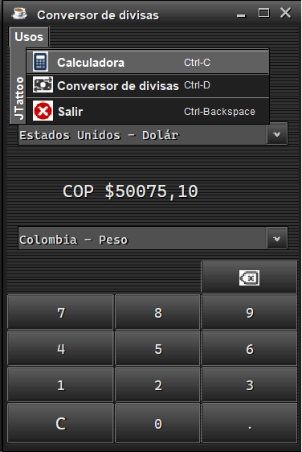

# calculadora

Esta aplicacion tiene las opciones de calculadora con las principales operaciones suma, resta, multiplicacion, division, raiz cuadrada y conversor de divisas para las monedas COP, UDS, EUR y GBP (tasa de conversion 30 de octubre 2022)

---
## Calculadora

---
## Conversor de divisas

